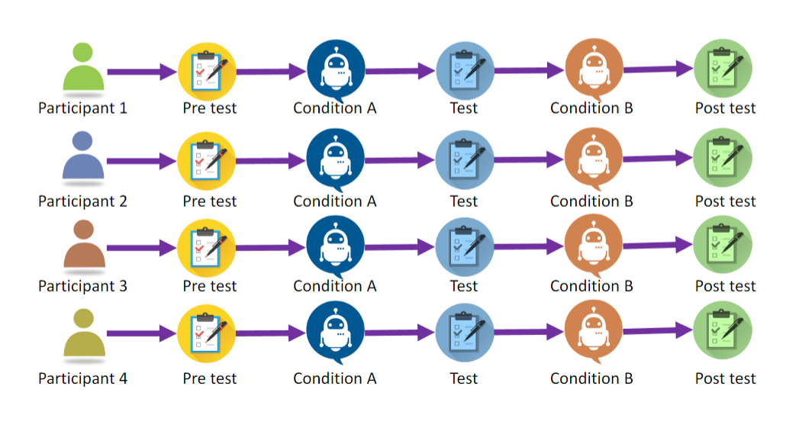

# **Task 4**

---

### The Questionnaires

for this task, we need to produce any/all questionnaires which will be presented to the participants

As we will be using **Within Subjects Design** (One User, Both Conditions), we will need 3 questionnaires. A pre-Experiment, a between and a Post Experiment

A few things to remember about the Pre Questionnaires

- do not reveal any info about the prototypes
- The questionnaires are used to gather info about the participants

A few things to remember about the Between Questionnaires

- **AGAIN** do not reveal the next prototype
- don't ask ambigous questions
- don't ask binary questions to provide preference between prototypes

we will be using Self-administered questionnaires

here are a few helpful resources for developing questionnaires

1. [Video](https://www.youtube.com/watch?v=_zoIVE9PRTM&ab_channel=DrHayleyStainton)
2. [Blog](https://imotions.com/blog/learning/best-practice/design-a-questionnaire/)
